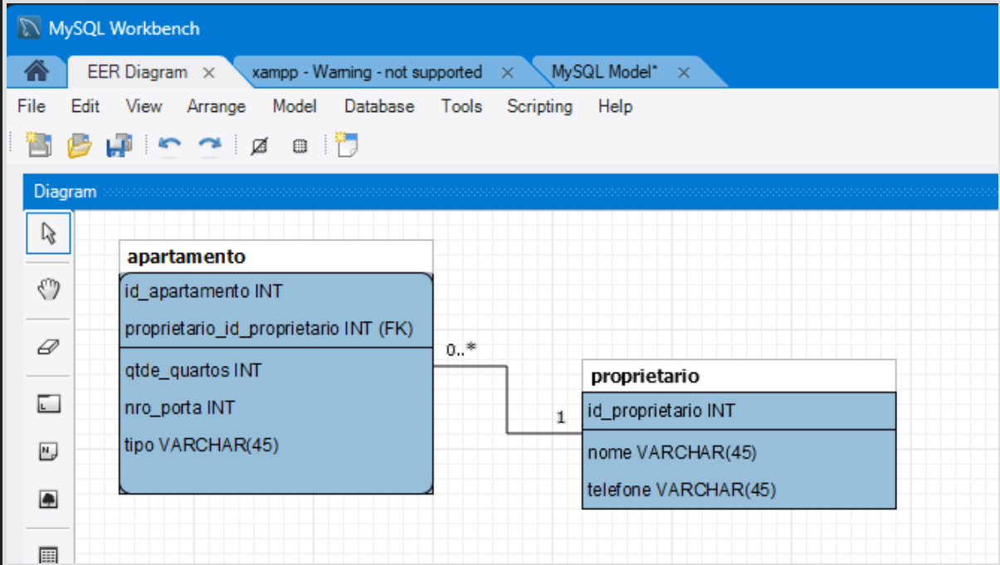

# **Roteiro de Desenvolvimento - Sistema de Condomínio**

## Sistema Web MVC com Spring Boot, JPA e H2

## 1\. Análise do Problema

Marina é síndica do prédio onde mora. A fim de melhor gerenciar o condomínio, ela encomendou uma aplicação a um amigo. A aplicação deve atender aos seguintes requisitos:

*   Para um apartamento, devem-se cadastrar: seu **número de porta**, a **quantidade de quartos**, o **tipo de ocupação** (proprietário, inquilino ou vazio), o **nome do proprietário** e o **telefone do proprietário**.
*   Um **proprietário pode ter mais de um apartamento** no prédio.

### Regras de Negócio Identificadas:

*   Cada apartamento tem exatamente um proprietário associado
*   Um proprietário pode possuir múltiplos apartamentos (relacionamento 1:N)
*   Tipo de ocupação: String com valores fixos ("proprietário", "inquilino", "vazio")

---

## 2\. Modelagem do Banco de Dados (DER)


## 3\. Criação das Classes de Modelo (Entidades JPA)

### 3.1. Conceitos Fundamentais

As classes de modelo representam as **entidades** do nosso domínio de negócio e são mapeadas para tabelas do banco de dados usando **JPA (Java Persistence API)**. Com Spring Data JPA, não precisamos escrever SQL manualmente - o framework cuida da persistência para nós.

#### Por que usar JPA?

*   **Produtividade**: Menos código SQL manual
*   **Portabilidade**: Funciona com diferentes bancos de dados (H2, MySQL, PostgreSQL, etc.)
*   **Manutenibilidade**: Código mais limpo e fácil de entender
*   **Relacionamentos**: Gerenciamento automático de relacionamentos entre entidades

### 3.2. Estrutura do Projeto

Organize suas classes no pacote:

```
src/main/java/com/professorangoti/condominio/model/
```

### 3.3. Implementação da Entidade Proprietario

**Arquivo:** `src/main/java/com/professorangoti/condominio/model/Proprietario.java`

```java
package com.professorangoti.condominio.model;

import jakarta.persistence.*;
import jakarta.validation.constraints.*;
import lombok.AllArgsConstructor;
import lombok.Data;
import lombok.NoArgsConstructor;

import java.util.ArrayList;
import java.util.List;

/**
 * Entidade JPA que representa um proprietário no sistema de condomínio.
 * Um proprietário pode possuir múltiplos apartamentos (relacionamento 1:N).
 */
@Entity
@Table(name = "proprietario")
@Data
@NoArgsConstructor
@AllArgsConstructor
public class Proprietario {

    /**
     * Chave primária gerada automaticamente pelo banco de dados.
     * A estratégia IDENTITY é ideal para H2, MySQL e PostgreSQL.
     */
    @Id
    @GeneratedValue(strategy = GenerationType.IDENTITY)
    @Column(name = "id_proprietario")
    private Long id;

    /**
     * Nome do proprietário.
     * Validações:
     * - Não pode ser nulo ou vazio
     * - Deve ter entre 3 e 100 caracteres
     */
    @NotBlank(message = "O nome do proprietário é obrigatório")
    @Size(min = 3, max = 100, message = "O nome deve ter entre 3 e 100 caracteres")
    @Column(nullable = false, length = 100)
    private String nome;

    /**
     * Telefone de contato do proprietário.
     * Validações:
     * - Não pode ser nulo ou vazio
     * - Deve seguir padrão brasileiro: (XX) XXXXX-XXXX ou (XX) XXXX-XXXX
     */
    @NotBlank(message = "O telefone é obrigatório")
    @Pattern(
        regexp = "\\(\\d{2}\\)\\s?\\d{4,5}-\\d{4}",
        message = "Telefone deve estar no formato (XX) XXXXX-XXXX"
    )
    @Column(nullable = false, length = 20)
    private String telefone;

    /**
     * Relacionamento bidirecional 1:N com Apartamento.
     * Um proprietário pode ter vários apartamentos.
     *
     * mappedBy: indica que o relacionamento é gerenciado pelo atributo
     *           "proprietario" na classe Apartamento
     * cascade: operações em cascata (salvar proprietário salva apartamentos)
     * orphanRemoval: remove apartamentos órfãos (sem proprietário)
     * fetch: LAZY = carrega apartamentos apenas quando acessados
     */
    @OneToMany(
        mappedBy = "proprietario",
        cascade = CascadeType.ALL,
        orphanRemoval = true,
        fetch = FetchType.LAZY
    )
    private List<Apartamento> apartamentos = new ArrayList<>();

    /**
     * Método auxiliar para adicionar um apartamento à lista.
     * Mantém sincronização bidirecional do relacionamento.
     */
    public void adicionarApartamento(Apartamento apartamento) {
        apartamentos.add(apartamento);
        apartamento.setProprietario(this);
    }

    /**
     * Método auxiliar para remover um apartamento da lista.
     * Mantém sincronização bidirecional do relacionamento.
     */
    public void removerApartamento(Apartamento apartamento) {
        apartamentos.remove(apartamento);
        apartamento.setProprietario(null);
    }
}
```

### 3.4. Implementação da Entidade Apartamento

**Arquivo:** `src/main/java/com/professorangoti/condominio/model/Apartamento.java`

```java
package com.professorangoti.condominio.model;

import jakarta.persistence.*;
import jakarta.validation.constraints.*;
import lombok.AllArgsConstructor;
import lombok.Data;
import lombok.NoArgsConstructor;

/**
 * Entidade JPA que representa um apartamento no sistema de condomínio.
 * Cada apartamento pertence a exatamente um proprietário (relacionamento N:1).
 */
@Entity
@Table(name = "apartamento")
@Data
@NoArgsConstructor
@AllArgsConstructor
public class Apartamento {

    /**
     * Chave primária gerada automaticamente.
     */
    @Id
    @GeneratedValue(strategy = GenerationType.IDENTITY)
    @Column(name = "id_apartamento")
    private Long id;

    /**
     * Número da porta do apartamento.
     * Validações:
     * - Não pode ser nulo
     * - Deve ser um número positivo
     */
    @NotNull(message = "O número da porta é obrigatório")
    @Min(value = 1, message = "O número da porta deve ser maior que zero")
    @Column(name = "numero_porta", nullable = false)
    private Integer numeroPorta;

    /**
     * Quantidade de quartos do apartamento.
     * Validações:
     * - Não pode ser nulo
     * - Deve ser entre 1 e 10
     */
    @NotNull(message = "A quantidade de quartos é obrigatória")
    @Min(value = 1, message = "Deve haver pelo menos 1 quarto")
    @Max(value = 10, message = "Máximo de 10 quartos permitido")
    @Column(name = "quantidade_quartos", nullable = false)
    private Integer quantidadeQuartos;

    /**
     * Tipo de ocupação do apartamento.
     * Valores possíveis: "Proprietário", "Inquilino", "Vazio"
     *
     * Nota: Em um cenário real, seria melhor usar um Enum.
     * Aqui mantemos String por simplicidade didática.
     */
    @NotBlank(message = "O tipo de ocupação é obrigatório")
    @Pattern(
        regexp = "Proprietário|Inquilino|Vazio",
        message = "Tipo de ocupação deve ser: Proprietário, Inquilino ou Vazio"
    )
    @Column(name = "tipo_ocupacao", nullable = false, length = 20)
    private String tipoOcupacao;

    /**
     * Relacionamento N:1 com Proprietario.
     * Vários apartamentos pertencem a um proprietário.
     *
     * fetch: EAGER = sempre carrega o proprietário junto com o apartamento
     * optional: false = todo apartamento DEVE ter um proprietário
     *
     * @JoinColumn especifica o nome da coluna de chave estrangeira
     */
    @ManyToOne(fetch = FetchType.EAGER, optional = false)
    @JoinColumn(
        name = "proprietario_id",
        nullable = false,
        foreignKey = @ForeignKey(name = "fk_apartamento_proprietario")
    )
    @NotNull(message = "O proprietário é obrigatório")
    private Proprietario proprietario;

    /**
     * Construtor auxiliar sem o ID (útil para criação de novos apartamentos).
     */
    public Apartamento(Integer numeroPorta, Integer quantidadeQuartos,
                      String tipoOcupacao, Proprietario proprietario) {
        this.numeroPorta = numeroPorta;
        this.quantidadeQuartos = quantidadeQuartos;
        this.tipoOcupacao = tipoOcupacao;
        this.proprietario = proprietario;
    }
}
```

### 3.5. Anotações JPA Explicadas

#### Anotações de Classe

*   `**@Entity**`: Marca a classe como uma entidade JPA (será mapeada para tabela)
*   `**@Table(name = "...")**`: Define o nome da tabela no banco de dados
*   `**@Data**` (Lombok): Gera getters, setters, toString(), equals() e hashCode()
*   `**@NoArgsConstructor**` (Lombok): Gera construtor vazio (exigido pelo JPA)
*   `**@AllArgsConstructor**` (Lombok): Gera construtor com todos os atributos

#### Anotações de Atributo

*   `**@Id**`: Marca o atributo como chave primária
*   `**@GeneratedValue**`: Define estratégia de geração automática do ID
    *   `IDENTITY`: Usa auto-increment do banco (ideal para H2, MySQL, PostgreSQL)
    *   `SEQUENCE`: Usa sequences (Oracle, PostgreSQL)
    *   `TABLE`: Usa tabela auxiliar
    *   `AUTO`: Deixa o provedor JPA decidir
*   `**@Column**`: Configura detalhes da coluna no banco
    *   `name`: Nome da coluna
    *   `nullable`: Se aceita NULL
    *   `length`: Tamanho máximo (para String)
    *   `unique`: Se valor deve ser único

#### Anotações de Relacionamento

`**@OneToMany**`: Relacionamento 1 para N (um proprietário → vários apartamentos)

*   `mappedBy`: Indica qual atributo na outra classe gerencia o relacionamento
*   `cascade`: Define operações em cascata (ALL, PERSIST, REMOVE, etc.)
*   `orphanRemoval`: Remove entidades órfãs
*   `fetch`: LAZY (carrega sob demanda) ou EAGER (carrega imediatamente)

`**@ManyToOne**`: Relacionamento N para 1 (vários apartamentos → um proprietário)

*   `fetch`: EAGER (carrega sempre) ou LAZY (carrega sob demanda)
*   `optional`: Se o relacionamento é opcional (false = obrigatório)

`**@JoinColumn**`: Define a coluna de chave estrangeira

*   `name`: Nome da coluna FK
*   `nullable`: Se aceita NULL
*   `foreignKey`: Configura constraint de FK

#### Anotações de Validação (Bean Validation)

*   `**@NotNull**`: Valor não pode ser null
*   `**@NotBlank**`: String não pode ser null, vazia ou apenas espaços
*   `**@Size**`: Define tamanho mínimo/máximo
*   `**@Min**` **/** `**@Max**`: Valor mínimo/máximo para números
*   `**@Pattern**`: Valida contra expressão regular

### 3.6. Diagrama de Classes JPA

```
┌─────────────────────────┐         ┌─────────────────────────┐
│     Proprietario        │         │      Apartamento        │
├─────────────────────────┤         ├─────────────────────────┤
│ - id: Long              │1       *│ - id: Long              │
│ - nome: String          │◄────────│ - numeroPorta: Integer  │
│ - telefone: String      │         │ - quantidadeQuartos: Int│
│ - apartamentos: List    │         │ - tipoOcupacao: String  │
└─────────────────────────┘         │ - proprietario          │
                                    └─────────────────────────┘
```

### 3.7. Como o JPA Cria as Tabelas no Banco

Com a configuração `spring.jpa.hibernate.ddl-auto=update` no `application.properties`, o Hibernate criará automaticamente as seguintes tabelas no H2:

**Tabela proprietario:**

```
CREATE TABLE proprietario (
    id_proprietario BIGINT AUTO_INCREMENT PRIMARY KEY,
    nome VARCHAR(100) NOT NULL,
    telefone VARCHAR(20) NOT NULL
);
```

**Tabela apartamento:**

```
CREATE TABLE apartamento (
    id_apartamento BIGINT AUTO_INCREMENT PRIMARY KEY,
    numero_porta INTEGER NOT NULL,
    quantidade_quartos INTEGER NOT NULL,
    tipo_ocupacao VARCHAR(20) NOT NULL,
    proprietario_id BIGINT NOT NULL,
    CONSTRAINT fk_apartamento_proprietario
        FOREIGN KEY (proprietario_id)
        REFERENCES proprietario(id_proprietario)
);
```

### 3.8. Testando as Entidades

Após criar as classes, você pode testá-las com um `CommandLineRunner`:

```java
package com.professorangoti.condominio;

import com.professorangoti.condominio.model.Apartamento;
import com.professorangoti.condominio.model.Proprietario;
import com.professorangoti.condominio.repository.ProprietarioRepository;
import org.springframework.boot.CommandLineRunner;
import org.springframework.boot.SpringApplication;
import org.springframework.boot.autoconfigure.SpringBootApplication;
import org.springframework.context.annotation.Bean;

@SpringBootApplication
public class CondominioApplication {

    public static void main(String[] args) {
        SpringApplication.run(CondominioApplication.class, args);
    }

    @Bean
    CommandLineRunner testarEntidades(ProprietarioRepository repository) {
        return args -> {
            // Criar um proprietário
            Proprietario maria = new Proprietario();
            maria.setNome("Maria Silva");
            maria.setTelefone("(11) 98765-4321");

            // Criar apartamentos para Maria
            Apartamento apto101 = new Apartamento(101, 2, "Proprietário", maria);
            Apartamento apto102 = new Apartamento(102, 3, "Inquilino", maria);

            // Adicionar apartamentos ao proprietário
            maria.adicionarApartamento(apto101);
            maria.adicionarApartamento(apto102);

            // Salvar (cascade salvará os apartamentos automaticamente)
            repository.save(maria);

            System.out.println("Dados de teste inseridos com sucesso!");
        };
    }
}
```

---

## 4\. Arquitetura em Camadas do Projeto Spring Boot

### 4.1. Visão Geral da Arquitetura MVC

O projeto segue o padrão **MVC (Model-View-Controller)** com uma arquitetura em camadas bem definida. Cada camada tem uma responsabilidade específica, promovendo **separação de responsabilidades** e facilitando a manutenção do código.

### 4.2. Estrutura de Pacotes

Organize seu projeto com a seguinte estrutura de pastas:

```
src/main/java/com/professorangoti/condominio/
├── model/                    # Camada de Modelo (Entidades JPA)
│   ├── Proprietario.java
│   └── Apartamento.java
│
│
├── repository/               # Camada de Persistência (Repositories)
│   ├── ProprietarioRepository.java
│   └── ApartamentoRepository.java
│
├── service/                  # Camada de Negócio (Services) - Opcional
│   ├── ProprietarioService.java
│   └── ApartamentoService.java
│
├── controller/               # Camada de Controle (Controllers)
│   ├── ProprietarioController.java
│   └── ApartamentoController.java
│
└── CondominioApplication.java  # Classe principal Spring Boot

src/main/resources/
├── application.properties    # Configurações da aplicação
└── templates/               # Camada de Visualização (Views Thymeleaf)
    ├── form_prop.html       # Formulário de proprietário
    ├── rel_prop.html        # Relatório de proprietários
    ├── form_apto.html       # Formulário de apartamento
    └── rel_apto.html        # Relatório de apartamentos
```

### 4.3. Diagrama de Camadas e Fluxo de Dados

```
┌─────────────────────────────────────────────────────────────────────┐
│                         NAVEGADOR (Cliente)                         │
│                    http://localhost:8080/cad-prop                   │
└────────────────────────────────┬────────────────────────────────────┘
                                 │ HTTP Request (GET/POST)
                                 ▼
┌─────────────────────────────────────────────────────────────────────┐
│                      CAMADA DE CONTROLE (Controller)                │
│  ┌───────────────────────────────────────────────────────────────┐  │
│  │ @Controller                                                   │  │
│  │ ProprietarioController / ApartamentoController                │  │
│  │                                                               │  │
│  │ Responsabilidades:                                            │  │
│  │ • Receber requisições HTTP                                    │  │
│  │ • Validar dados do formulário (@Valid)                        │  │
│  │ • Chamar métodos da camada Service/Repository                 │  │
│  │ • Preparar dados para a View (Model.addAttribute)             │  │
│  │ • Retornar nome do template Thymeleaf                         │  │
│  │                                                               │  │
│  │ Exemplo: @GetMapping("/cad-prop")                             │  │
│  └───────────────────────────────────────────────────────────────┘  │
└────────────────────────────────┬────────────────────────────────────┘
                                 │ Chama métodos
                                 ▼
┌─────────────────────────────────────────────────────────────────────┐
│               CAMADA DE NEGÓCIO (Service)                           │
│  ┌───────────────────────────────────────────────────────────────┐  │
│  │ @Service                                                      │  │
│  │ ProprietarioService / ApartamentoService                      │  │
│  │                                                               │  │
│  │ Responsabilidades:                                            │  │
│  │ • Implementar regras de negócio complexas                     │  │
│  │ • Validações adicionais                                       │  │
│  │ • Transações (@Transactional)                                 │  │
│  │ • Coordenar múltiplos Repositories                            │  │
│  │                                                               │  │
│  │ Nota: Em projetos simples, o Controller pode chamar           │  │
│  │       diretamente o Repository                                │  │
│  └───────────────────────────────────────────────────────────────┘  │
└────────────────────────────────┬────────────────────────────────────┘
                                 │ Chama métodos
                                 ▼
┌─────────────────────────────────────────────────────────────────────┐
│              CAMADA DE PERSISTÊNCIA (Repository)                    │
│  ┌───────────────────────────────────────────────────────────────┐  │
│  │ @Repository (interface)                                       │  │
│  │ extends JpaRepository<Entidade, Long>                         │  │
│  │                                                               │  │
│  │ Responsabilidades:                                            │  │
│  │ • Comunicação com o banco de dados                            │  │
│  │ • Operações CRUD (Create, Read, Update, Delete)               │  │
│  │ • Queries personalizadas (@Query)                             │  │
│  │                                                               │  │
│  │ Métodos herdados automaticamente:                             │  │
│  │ • save(entity)           - Salvar/Atualizar                   │  │
│  │ • findById(id)           - Buscar por ID                      │  │
│  │ • findAll()              - Listar todos                       │  │
│  │ • deleteById(id)         - Deletar por ID                     │  │
│  │ • count()                - Contar registros                   │  │
│  └───────────────────────────────────────────────────────────────┘  │
└────────────────────────────────┬────────────────────────────────────┘
                                 │ Operações SQL
                                 ▼
┌─────────────────────────────────────────────────────────────────────┐
│                      CAMADA DE MODELO (Model/Entity)                │
│  ┌───────────────────────────────────────────────────────────────┐  │
│  │ @Entity                                                       │  │
│  │ Proprietario / Apartamento                                    │  │
│  │                                                               │  │
│  │ Responsabilidades:                                            │  │
│  │ • Representar a estrutura de dados                            │  │
│  │ • Mapeamento Objeto-Relacional (ORM)                          │  │
│  │ • Definir relacionamentos entre entidades                     │  │
│  │ • Validações de dados (@NotNull, @Size, etc.)                 │  │
│  │                                                               │  │
│  │ Anotações principais:                                         │  │
│  │ • @Id, @GeneratedValue   - Chave primária                     │  │
│  │ • @Column                - Detalhes da coluna                 │  │
│  │ • @OneToMany, @ManyToOne - Relacionamentos                    │  │
│  └───────────────────────────────────────────────────────────────┘  │
└────────────────────────────────┬────────────────────────────────────┘
                                 │ JPA/Hibernate
                                 ▼
┌─────────────────────────────────────────────────────────────────────┐
│                    BANCO DE DADOS (H2 Database)                     │
│  ┌───────────────────────────────────────────────────────────────┐  │
│  │ Tabelas:                                                      │  │
│  │ • proprietario (id_proprietario, nome, telefone)              │  │
│  │ • apartamento (id_apartamento, numero_porta,                  │  │
│  │                quantidade_quartos, tipo_ocupacao,             │  │
│  │                proprietario_id)                               │  │
│  │                                                               │  │
│  │ Console H2: http://localhost:8080/h2-console                  │  │
│  └───────────────────────────────────────────────────────────────┘  │
└────────────────────────────────┬────────────────────────────────────┘
                                 │ Dados retornados
                                 ▼
┌─────────────────────────────────────────────────────────────────────┐
│                    CAMADA DE VISUALIZAÇÃO (View)                    │
│  ┌───────────────────────────────────────────────────────────────┐  │
│  │ Templates Thymeleaf (.html)                                   │  │
│  │                                                               │  │
│  │ Responsabilidades:                                            │  │
│  │ • Renderizar HTML dinâmico                                    │  │
│  │ • Exibir dados vindos do Controller (Model)                   │  │
│  │ • Capturar entrada do usuário (formulários)                   │  │
│  │ • Exibir mensagens de validação e erros                       │  │
│  │                                                               │  │
│  │ Sintaxe Thymeleaf:                                            │  │
│  │ • th:object    - Vincular objeto ao formulário                │  │
│  │ • th:field     - Vincular campo ao atributo do objeto         │  │
│  │ • th:each      - Iterar sobre lista                           │  │
│  │ • th:text      - Exibir texto                                 │  │
│  │ • th:errors    - Exibir erros de validação                    │  │
│  └───────────────────────────────────────────────────────────────┘  │
└────────────────────────────────┬────────────────────────────────────┘
                                 │ HTML Response
                                 ▼
┌─────────────────────────────────────────────────────────────────────┐
│                         NAVEGADOR (Cliente)                         │
│                    Exibe a página renderizada                       │
└─────────────────────────────────────────────────────────────────────┘
```

### 4.4. Responsabilidade de Cada Camada

| Camada | Responsabilidade | Não Deve Fazer |
| --- | --- | --- |
| **View (Template)** | Exibir dados, capturar entrada do usuário | Lógica de negócio, acesso ao banco |
| **Controller** | Receber requisições, validar entrada, preparar dados para View | Lógica de negócio complexa, SQL direto |
| **Service** | Regras de negócio, transações | Renderizar HTML, SQL direto |
| **Repository** | Acesso ao banco de dados, queries | Lógica de negócio, validações |
| **Model (Entity)** | Representar dados, validações básicas | Lógica de negócio, acesso ao banco |

### 4.5. Benefícios da Arquitetura em Camadas

✅ **Separação de Responsabilidades**: Cada camada tem um propósito claro  
✅ **Facilita Manutenção**: Mudanças em uma camada não afetam as outras  
✅ **Testabilidade**: Cada camada pode ser testada independentemente  
✅ **Reusabilidade**: Código pode ser reutilizado em diferentes contextos  
✅ **Escalabilidade**: Facilita expansão futura do sistema

### 4.6. Quando Usar a Camada Service?

A camada **Service** é **opcional** em projetos simples. Use quando:

*   Houver **lógica de negócio complexa**
*   Precisar **coordenar múltiplos repositories**
*   Necessitar de **controle de transações** (@Transactional)
*   Precisar **reutilizar lógica** em múltiplos controllers

**Para este projeto de condomínio**, podemos **simplificar** e ter o Controller chamando diretamente o Repository, pois a lógica é simples (apenas CRUD básico).

---

## 5\. Criação dos Repositories JPA

### 5.1. O que são Repositories?

**Repositories** são interfaces que atuam como a **camada de acesso a dados** (Data Access Layer) da aplicação. Com **Spring Data JPA**, não precisamos escrever implementações dessas interfaces - o Spring cria automaticamente as implementações em tempo de execução!

#### Principais Benefícios:

*   ✅ **Zero implementação**: Não precisa escrever SQL ou código de persistência
*   ✅ **Métodos prontos**: CRUD completo disponível automaticamente
*   ✅ **Type-safe**: Métodos fortemente tipados
*   ✅ **Queries personalizadas**: Suporte para criar queries complexas quando necessário
*   ✅ **Paginação e ordenação**: Suporte nativo para grandes volumes de dados

### 5.2. Hierarquia de Interfaces Spring Data

```
Repository<T, ID>                    (Marcador - sem métodos)
    ↓
CrudRepository<T, ID>                (Métodos CRUD básicos)
    ↓
PagingAndSortingRepository<T, ID>    (+ Paginação e ordenação)
    ↓
JpaRepository<T, ID>                 (+ Métodos específicos JPA)
```

**Usaremos** `**JpaRepository**` pois é a mais completa e oferece todos os recursos necessários.

### 5.3. Implementação do ProprietarioRepository

Crie a interface no pacote `repository`:

**Arquivo:** `src/main/java/com/professorangoti/condominio/repository/ProprietarioRepository.java`

```java
package com.professorangoti.condominio.repository;

import com.professorangoti.condominio.model.Proprietario;
import org.springframework.data.jpa.repository.JpaRepository;
import org.springframework.data.jpa.repository.Query;
import org.springframework.data.repository.query.Param;
import org.springframework.stereotype.Repository;

import java.util.List;
import java.util.Optional;

/**
 * Repository para operações de persistência da entidade Proprietario.
 *
 * Herda de JpaRepository<Proprietario, Long> onde:
 * - Proprietario: Tipo da entidade
 * - Long: Tipo da chave primária (@Id)
 *
 * @Repository é opcional quando se estende JpaRepository, mas é boa prática incluir.
 */
@Repository
public interface ProprietarioRepository extends JpaRepository<Proprietario, Long> {

    // ==================== MÉTODOS HERDADOS AUTOMATICAMENTE ====================
    // Você NÃO precisa implementar estes métodos, eles já existem!
    //
    // save(Proprietario p)              - Salvar ou atualizar
    // findById(Long id)                 - Buscar por ID
    // findAll()                         - Listar todos
    // findAll(Sort sort)                - Listar todos ordenados
    // findAll(Pageable pageable)        - Listar com paginação
    // count()                           - Contar registros
    // existsById(Long id)               - Verificar se existe
    // deleteById(Long id)               - Deletar por ID
    // delete(Proprietario p)            - Deletar entidade
    // deleteAll()                       - Deletar todos
    // flush()                           - Forçar sincronização com BD
    // saveAndFlush(Proprietario p)      - Salvar e sincronizar
    // ===========================================================================


    // ==================== MÉTODOS DE CONSULTA PERSONALIZADOS ====================

    /**
     * Busca proprietários por nome (busca exata, case-sensitive).
     *
     * Query Method: Spring Data interpreta o nome do método e cria a query SQL.
     * Padrão: findBy + NomeDoAtributo
     */
    List<Proprietario> findByNome(String nome);

    /**
     * Busca proprietários cujo nome contenha o texto fornecido (case-insensitive).
     *
     * Exemplo: findByNomeContainingIgnoreCase("silva")
     *          encontra "Silva", "SILVA", "João Silva", etc.
     */
    List<Proprietario> findByNomeContainingIgnoreCase(String nome);

    /**
     * Busca proprietário por telefone (busca exata).
     * Retorna Optional porque pode não encontrar nenhum.
     */
    Optional<Proprietario> findByTelefone(String telefone);

    /**
     * Busca proprietários cujo nome comece com o texto fornecido.
     *
     * Exemplo: findByNomeStartingWith("Mar") encontra "Maria", "Marcos", etc.
     */
    List<Proprietario> findByNomeStartingWith(String prefixo);

    /**
     * Busca proprietários ordenados por nome (ascendente).
     *
     * OrderBy + NomeDoAtributo + Asc/Desc
     */
    List<Proprietario> findAllByOrderByNomeAsc();

    /**
     * Conta quantos proprietários têm um determinado nome.
     */
    long countByNome(String nome);

    /**
     * Verifica se existe algum proprietário com o telefone fornecido.
     * Útil para validar telefones únicos.
     */
    boolean existsByTelefone(String telefone);


    // ==================== CONSULTAS JPQL PERSONALIZADAS ====================

    /**
     * Busca proprietários que possuem mais de N apartamentos.
     *
     * Usa @Query com JPQL (Java Persistence Query Language).
     * JPQL trabalha com objetos, não com tabelas SQL.
     *
     * @param minApartamentos Número mínimo de apartamentos
     * @return Lista de proprietários
     */
    @Query("SELECT p FROM Proprietario p WHERE SIZE(p.apartamentos) > :minApartamentos")
    List<Proprietario> findProprietariosComMaisDeNApartamentos(@Param("minApartamentos") int minApartamentos);

    /**
     * Busca proprietários que possuem ao menos um apartamento vazio.
     *
     * JOIN FETCH: carrega os apartamentos junto com o proprietário (evita lazy loading)
     */
    @Query("SELECT DISTINCT p FROM Proprietario p " +
           "JOIN FETCH p.apartamentos a " +
           "WHERE a.tipoOcupacao = 'Vazio'")
    List<Proprietario> findProprietariosComApartamentosVazios();

    /**
     * Conta total de apartamentos de um proprietário específico.
     *
     * Usa SQL nativo (nativeQuery = true).
     */
    @Query("SELECT COUNT(*) FROM apartamento WHERE proprietario_id = :proprietarioId",
           nativeQuery = true)
    long countApartamentosByProprietarioId(@Param("proprietarioId") Long proprietarioId);


    // ==================== EXEMPLO DE MÉTODO COMPLEXO ====================

    /**
     * Busca proprietários por múltiplos critérios.
     *
     * Demonstra uso de múltiplas condições no nome do método.
     */
    List<Proprietario> findByNomeContainingIgnoreCaseAndTelefoneContaining(
        String nome,
        String telefone
    );
}
```

### 5.4. Implementação do ApartamentoRepository

**Arquivo:** `src/main/java/com/professorangoti/condominio/repository/ApartamentoRepository.java`

```java
package com.professorangoti.condominio.repository;

import com.professorangoti.condominio.model.Apartamento;
import com.professorangoti.condominio.model.Proprietario;
import org.springframework.data.jpa.repository.JpaRepository;
import org.springframework.data.jpa.repository.Query;
import org.springframework.data.repository.query.Param;
import org.springframework.stereotype.Repository;

import java.util.List;
import java.util.Optional;

/**
 * Repository para operações de persistência da entidade Apartamento.
 */
@Repository
public interface ApartamentoRepository extends JpaRepository<Apartamento, Long> {

    // ==================== MÉTODOS DE CONSULTA POR ATRIBUTOS ====================

    /**
     * Busca apartamento por número da porta (deve ser único).
     */
    Optional<Apartamento> findByNumeroPorta(Integer numeroPorta);

    /**
     * Busca apartamentos por tipo de ocupação.
     *
     * Exemplo: findByTipoOcupacao("Vazio") retorna todos apartamentos vazios
     */
    List<Apartamento> findByTipoOcupacao(String tipoOcupacao);

    /**
     * Busca apartamentos por quantidade de quartos.
     */
    List<Apartamento> findByQuantidadeQuartos(Integer quantidade);

    /**
     * Busca apartamentos com quantidade de quartos maior ou igual ao valor.
     */
    List<Apartamento> findByQuantidadeQuartosGreaterThanEqual(Integer quantidade);

    /**
     * Busca todos os apartamentos de um proprietário específico.
     *
     * Nota: Proprietario é um objeto, não um ID.
     */
    List<Apartamento> findByProprietario(Proprietario proprietario);

    /**
     * Busca apartamentos por ID do proprietário.
     *
     * Usa notação de "navegação" através do relacionamento: proprietario.id
     */
    List<Apartamento> findByProprietarioId(Long proprietarioId);

    /**
     * Busca apartamentos por nome do proprietário (case-insensitive).
     */
    List<Apartamento> findByProprietarioNomeContainingIgnoreCase(String nomeProprietario);

    /**
     * Busca apartamentos ordenados por número da porta.
     */
    List<Apartamento> findAllByOrderByNumeroPortaAsc();

    /**
     * Verifica se já existe um apartamento com o número de porta fornecido.
     * Útil para validar unicidade antes de salvar.
     */
    boolean existsByNumeroPorta(Integer numeroPorta);

    /**
     * Conta quantos apartamentos estão vazios.
     */
    long countByTipoOcupacao(String tipoOcupacao);


    // ==================== CONSULTAS JPQL PERSONALIZADAS ====================

    /**
     * Busca apartamentos por múltiplos critérios.
     *
     * @param tipoOcupacao Tipo de ocupação (pode ser null para ignorar)
     * @param minQuartos Quantidade mínima de quartos
     * @return Lista de apartamentos que atendem os critérios
     */
    @Query("SELECT a FROM Apartamento a WHERE " +
           "(:tipoOcupacao IS NULL OR a.tipoOcupacao = :tipoOcupacao) AND " +
           "a.quantidadeQuartos >= :minQuartos")
    List<Apartamento> findByFiltros(
        @Param("tipoOcupacao") String tipoOcupacao,
        @Param("minQuartos") Integer minQuartos
    );

    /**
     * Busca apartamentos com seus proprietários (JOIN FETCH para evitar N+1 queries).
     *
     * Sempre carrega o proprietário junto, mais eficiente quando você sabe que vai precisar.
     */
    @Query("SELECT a FROM Apartamento a JOIN FETCH a.proprietario")
    List<Apartamento> findAllWithProprietarios();

    /**
     * Estatística: Média de quartos por tipo de ocupação.
     *
     * Exemplo de agregação usando JPQL.
     */
    @Query("SELECT AVG(a.quantidadeQuartos) FROM Apartamento a WHERE a.tipoOcupacao = :tipo")
    Double calcularMediaQuartosPorTipo(@Param("tipo") String tipo);

    /**
     * Busca apartamentos de proprietários que moram em mais de um apartamento.
     */
    @Query("SELECT a FROM Apartamento a WHERE " +
           "(SELECT COUNT(a2) FROM Apartamento a2 WHERE a2.proprietario = a.proprietario) > 1")
    List<Apartamento> findApartamentosDeProprietariosComMultiplosApartamentos();


    // ==================== CONSULTAS SQL NATIVAS ====================

    /**
     * Estatística usando SQL nativo: Total de apartamentos por tipo de ocupação.
     *
     * Retorna um resultado customizado (Object[]).
     */
    @Query(value = "SELECT tipo_ocupacao, COUNT(*) as total " +
                   "FROM apartamento " +
                   "GROUP BY tipo_ocupacao " +
                   "ORDER BY total DESC",
           nativeQuery = true)
    List<Object[]> estatisticasPorTipoOcupacao();

    /**
     * Deleta (logicamente) apartamentos por ID do proprietário.
     *
     * @Modifying indica que é uma query de modificação (UPDATE/DELETE).
     * @Transactional deve ser usado no serviço que chama este método.
     */
    // @Modifying
    // @Query("DELETE FROM Apartamento a WHERE a.proprietario.id = :proprietarioId")
    // void deleteByProprietarioId(@Param("proprietarioId") Long proprietarioId);
}
```

### 5.5. Padrões de Nomenclatura de Query Methods

O Spring Data JPA interpreta o nome do método e cria a query automaticamente. Principais palavras-chave:

| Palavra-chave | Exemplo | SQL Equivalente |
| --- | --- | --- |
| `findBy` | `findByNome(String nome)` | `WHERE nome = ?` |
| `findAllBy` | `findAllByNome(String nome)` | `WHERE nome = ?` |
| `countBy` | `countByTipoOcupacao(String tipo)` | `SELECT COUNT(*) WHERE tipo_ocupacao = ?` |
| `deleteBy` | `deleteByNumeroPorta(Integer numero)` | `DELETE WHERE numero_porta = ?` |
| `existsBy` | `existsByTelefone(String tel)` | `SELECT CASE WHEN EXISTS(...) THEN 1 ELSE 0 END` |
| `And` | `findByNomeAndTelefone(...)` | `WHERE nome = ? AND telefone = ?` |
| `Or` | `findByNomeOrTelefone(...)` | `WHERE nome = ? OR telefone = ?` |
| `Containing` | `findByNomeContaining(String texto)` | `WHERE nome LIKE %?%` |
| `StartingWith` | `findByNomeStartingWith(String inicio)` | `WHERE nome LIKE ?%` |
| `EndingWith` | `findByNomeEndingWith(String fim)` | `WHERE nome LIKE %?` |
| `IgnoreCase` | `findByNomeIgnoreCase(String nome)` | `WHERE UPPER(nome) = UPPER(?)` |
| `GreaterThan` | `findByIdadeGreaterThan(Integer idade)` | `WHERE idade > ?` |
| `LessThan` | `findByIdadeLessThan(Integer idade)` | `WHERE idade < ?` |
| `Between` | `findByIdadeBetween(Integer min, Integer max)` | `WHERE idade BETWEEN ? AND ?` |
| `OrderBy...Asc` | `findAllByOrderByNomeAsc()` | `ORDER BY nome ASC` |
| `OrderBy...Desc` | `findAllByOrderByNomeDesc()` | `ORDER BY nome DESC` |
| `IsNull` | `findByTelefoneIsNull()` | `WHERE telefone IS NULL` |
| `IsNotNull` | `findByTelefoneIsNotNull()` | `WHERE telefone IS NOT NULL` |

### 5.6. Testando os Repositories

Você pode testar os repositories criando dados de exemplo no `CommandLineRunner`:

```java
package com.professorangoti.condominio;

import com.professorangoti.condominio.model.Apartamento;
import com.professorangoti.condominio.model.Proprietario;
import com.professorangoti.condominio.repository.ApartamentoRepository;
import com.professorangoti.condominio.repository.ProprietarioRepository;
import org.springframework.boot.CommandLineRunner;
import org.springframework.boot.SpringApplication;
import org.springframework.boot.autoconfigure.SpringBootApplication;
import org.springframework.context.annotation.Bean;

@SpringBootApplication
public class CondominioApplication {

    public static void main(String[] args) {
        SpringApplication.run(CondominioApplication.class, args);
    }

    @Bean
    CommandLineRunner testarRepositories(
        ProprietarioRepository proprietarioRepo,
        ApartamentoRepository apartamentoRepo
    ) {
        return args -> {
            System.out.println("\n=== TESTANDO REPOSITORIES ===\n");

            // Criar proprietários
            Proprietario maria = new Proprietario();
            maria.setNome("Maria Silva");
            maria.setTelefone("(11) 98765-4321");
            proprietarioRepo.save(maria);

            Proprietario joao = new Proprietario();
            joao.setNome("João Santos");
            joao.setTelefone("(11) 91234-5678");
            proprietarioRepo.save(joao);

            System.out.println("✓ Proprietários salvos!");

            // Criar apartamentos
            Apartamento apto101 = new Apartamento(101, 2, "Proprietário", maria);
            Apartamento apto102 = new Apartamento(102, 3, "Inquilino", maria);
            Apartamento apto201 = new Apartamento(201, 1, "Vazio", joao);

            apartamentoRepo.save(apto101);
            apartamentoRepo.save(apto102);
            apartamentoRepo.save(apto201);

            System.out.println("✓ Apartamentos salvos!");

            // Testar consultas
            System.out.println("\n--- Testes de Consulta ---");

            System.out.println("Total de proprietários: " + proprietarioRepo.count());
            System.out.println("Total de apartamentos: " + apartamentoRepo.count());

            System.out.println("\nProprietários com 'Silva' no nome:");
            proprietarioRepo.findByNomeContainingIgnoreCase("silva")
                .forEach(p -> System.out.println("  - " + p.getNome()));

            System.out.println("\nApartamentos vazios:");
            apartamentoRepo.findByTipoOcupacao("Vazio")
                .forEach(a -> System.out.println("  - Apto " + a.getNumeroPorta()));

            System.out.println("\nApartamentos de Maria:");
            apartamentoRepo.findByProprietarioId(maria.getId())
                .forEach(a -> System.out.println("  - Apto " + a.getNumeroPorta() +
                    " (" + a.getQuantidadeQuartos() + " quartos)"));

            System.out.println("\n=== TESTES CONCLUÍDOS ===\n");
        };
    }
}
```

### 5.7. Métodos Mais Usados do JpaRepository

```java
// CREATE - Criar/Salvar
proprietarioRepo.save(proprietario);                    // Salva ou atualiza
proprietarioRepo.saveAll(List.of(p1, p2, p3));         // Salva múltiplos
proprietarioRepo.saveAndFlush(proprietario);           // Salva e sincroniza imediatamente

// READ - Consultar
proprietarioRepo.findById(1L);                         // Retorna Optional<Proprietario>
proprietarioRepo.findAll();                            // Retorna List<Proprietario>
proprietarioRepo.findAllById(List.of(1L, 2L, 3L));     // Retorna lista por IDs
proprietarioRepo.existsById(1L);                       // Retorna boolean
proprietarioRepo.count();                              // Retorna long

// UPDATE - Atualizar
// Mesmo método save() - JPA detecta se é novo ou existente pelo ID
Proprietario p = proprietarioRepo.findById(1L).get();
p.setNome("Novo Nome");
proprietarioRepo.save(p);                              // Atualiza

// DELETE - Deletar
proprietarioRepo.deleteById(1L);                       // Deleta por ID
proprietarioRepo.delete(proprietario);                 // Deleta objeto
proprietarioRepo.deleteAll();                          // Deleta todos (CUIDADO!)
proprietarioRepo.deleteAll(List.of(p1, p2));           // Deleta lista
```

### 5.8. Boas Práticas

✅ **Use Optional para retornos que podem ser nulos**

```java
Optional<Proprietario> findById(Long id);
```

✅ **Prefira Query Methods para consultas simples**

```java
List<Apartamento> findByTipoOcupacao(String tipo);  // Simples e legível
```

✅ **Use @Query para consultas complexas**

```java
@Query("SELECT a FROM Apartamento a WHERE ...")  // Mais controle
```

## 6\. Implementação dos Controllers

### 6.1. O que são Controllers?

**Controllers** são classes responsáveis por **receber requisições HTTP**, **processar dados** e **retornar respostas** (geralmente na forma de páginas HTML renderizadas pelo Thymeleaf). Eles fazem a ponte entre a **camada de apresentação (View)** e a **camada de persistência (Repository)**.

#### Conceitos Fundamentais

**Requisição HTTP** é identificada por:

**Tipo/Método**: GET, POST, PUT, DELETE, etc.

*   **GET**: Buscar dados, exibir páginas (navegação por links)
*   **POST**: Enviar dados de formulários, criar/atualizar registros

**Path/URL**: Caminho que identifica o recurso

*   Exemplo: `http://localhost:8080/cad_prop`
*   Path: `/cad_prop`


### 6.2 Planejamento dos endpoints

<table><tbody><tr><td><p style="text-align:center;"><strong>Ação</strong></p></td><td><p style="text-align:center;"><strong>Requisição</strong></p></td><td><p style="text-align:center;"><strong>URL</strong></p></td><td><p style="text-align:center;"><strong>Mapeamento</strong></p></td><td><p style="text-align:center;"><strong>Template Thymeleaf</strong></p></td></tr><tr><td>Gravar dados novo proprietário&nbsp;</td><td>POST</td><td>http://localhost:8080/cad-prop</td><td>@PostMapping(“cad-prop”)</td><td>rel_prop.html</td></tr><tr><td>Relatório proprietários</td><td>GET</td><td>http://localhost:8080/rel-prop</td><td>@GetMapping(“rel-prop”)</td><td>rel_prop.html</td></tr><tr><td>Gravar dados novo apartamento</td><td>POST</td><td>http://localhost:8080/cad-apto</td><td>@PostMapping(“cad-apto”)</td><td>rel_apto.html</td></tr><tr><td>Relatório apartamentos</td><td>GET</td><td>http://localhost:8080/rel-apto</td><td>@GetMapping(“rel-apto”)</td><td>rel_apto.html</td></tr></tbody></table>

6.3. Implementação do ProprietarioController

**Arquivo:** `src/main/java/com/professorangoti/condominio/controller/ProprietarioController.java`

```java
// Implementação conforme exemplo Torresmo Delivery
```

### 6.4. Implementação do ApartamentoController

**Arquivo:** `src/main/java/com/professorangoti/condominio/controller/ApartamentoController.java`

```java
// Implementação conforme exemplo Torresmo Delivery
```

### 6.5. Anotações Spring MVC Explicadas

#### Anotações de Classe

*   `**@Controller**`: Marca a classe como um controller Spring MVC
*   `**@RequestMapping("/prefixo")**`: Define prefixo para todas as URLs do controller

#### Anotações de Método

*   `**@GetMapping("/path")**`: Atende requisições GET
*   `**@PostMapping("/path")**`: Atende requisições POST
*   `**@PathVariable("nome")**`: Captura valor da URL (`/editar/{id}`)

## 7\. Implementação das views

```java
// Implementação conforme exemplo Torresmo Delivery
```

## Anexos

*   Configuração do projeto

Arquivo src\\main\\resources\\application.properties

```
# H2 Database Configuration
spring.datasource.url=jdbc:h2:file:./data/torresmo
spring.datasource.driverClassName=org.h2.Driver
spring.datasource.username=sa
spring.datasource.password=

# H2 Console (accessible at http://localhost:8080/h2-console)
spring.h2.console.enabled=true
spring.h2.console.path=/h2-console

# JPA/Hibernate Configuration
spring.jpa.database-platform=org.hibernate.dialect.H2Dialect
spring.jpa.hibernate.ddl-auto=update
spring.jpa.show-sql=true
spring.jpa.properties.hibernate.format_sql=true

# DevTools & Thymeleaf Hot Reload Configuration
spring.thymeleaf.cache=false
spring.devtools.livereload.enabled=true
spring.devtools.restart.enabled=true
spring.devtools.restart.additional-paths=src/main/resources/templates,src/main/resources/static
```